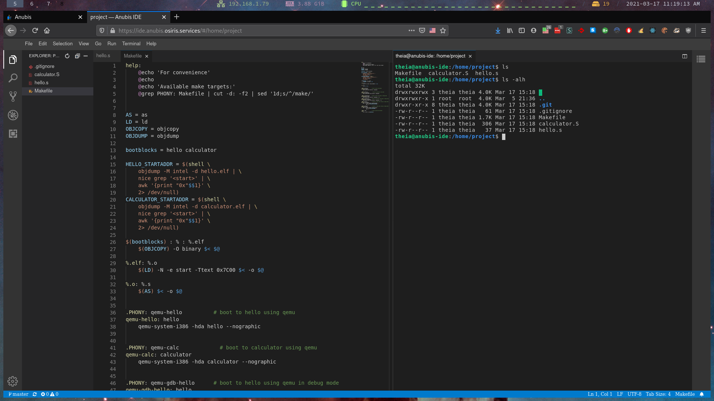

# Anubis Autograder

## Elevator Pitch

At its core, Anubis is a tool to give students live feedback from their homework
assignments
while they are working on them. Using [Github Classrooms](https://classroom.github.com/),
each student gets their
own repo from a template
for each homework assignment. The way students then submit their work
is simply by pushing their work to their repo before the deadline. Students can
then push, and therefore submit as many times as
they would like before the deadline.

## Assignment structure

When a student pushes to their assignment repo, a job is launched on the Anubis
cluster. That job will build
their repo, run tests on the results, and store the results in a database.

Students can then navigate to the Anubis website, where
they will sign in through NYU SSO.
From there,
they will be able to see all the current and past assignments,
and all of their submissions. They are able
to view the results of the build and tests for each submission.
There they can request a regrade,
there by launching a new submission pipeline. While the submission
still being processed, the website will poll
the backend for updates. In this, the website will be constantly
updating while the submission is being
processed, giving a live and interactive feel to the site. Once
a submission is processed Anubis will show
the students logs from their tests, and builds along with which
tests passed and which failed.

## Anubis Cloud IDEs

New in version v2.2.0, there is now the Anubis Cloud IDE. Using some
kubernetes magic, we are able to
host [theia](https://theia-ide.org/) servers for individual students.
These are essentially
VSCode instances
that students can access in the browser. What makes these so powerful
is that students can access a terminal
and type commands right into a bash shell which will be run in the
remote container. With this setup students
have access to a fully insulated and prebuilt linux
environment at a click of a button. These environments are easily customizable
for the needs of the class or even individual assignments. Because these
IDE servers are light weight docker containers we can support
many more students than if we used VMs. There are ~130 students in the Intro
to OS course in spring of 2021, and we could support all of them
using IDEs at the same time while still processing all the submissions that
come through.

As we are giving students access to a terminal in the cloud, we must also lock
down their environment. All student IDEs are limited in the RAM, CPU, storage,
and networking. From the IDEs, students are only able to connect to Github to
submit their work.

> Does any of this sound appealing to you? Reach out to us to see if Anubis is
something that can benefit your class!
